# Diagrama de flujo — esp32_weather_station.ino

Este archivo contiene un diagrama de flujo visual (Mermaid) que describe el comportamiento del sketch `esp32_weather_station.ino`.

## Diagrama (Mermaid)

```mermaid
flowchart TD
  Start([Start]) --> Setup["setup()- Serial.begin<br/>- Wire.begin<br/>- check BMP sensor<br/>- dht.begin<br/>- init buffers<br/>- start WiFi AP<br/>- build HTML page<br/>- register endpoints (/ and /data)<br/>- server.begin<br/>- lastSample = millis() - SAMPLE_INTERVAL"]

  Setup --> LoopStart([loop])
  LoopStart --> CheckSample{"millis() - lastSample >= SAMPLE_INTERVAL?"}

  CheckSample -- No --> HandleClient[("server.handleClient()<br/>(serve requests)<br/>loop back")]
  HandleClient --> LoopStart

  CheckSample -- Yes --> SampleNow["Actualizar lastSample<br/>Leer sensores"]

  SampleNow --> ReadDHT["Leer DHT: T = readTemperature(), H = readHumidity()"]
  ReadDHT --> DHTNaN{"T o H es NaN?"}
  DHTNaN -- Yes --> KeepPrev["Registrar warning<br/>No actualizar buffer con NaN (mantener prev. si existen)"]
  DHTNaN -- No --> UseDHT["Usar T y H leídos"]

  KeepPrev --> ReadBMP
  UseDHT --> ReadBMP

  ReadBMP["BMP: if (bmp.begin()) -> readPressure()/100.0 -> P (hPa)<br/>else -> P = 0, log warning"] --> FillBuffers

  FillBuffers["tempBuf[bufIndex]=T; humBuf[bufIndex]=H; presBuf[bufIndex]=P;<br/>bufIndex=(bufIndex+1)%SMA_SIZE; if(bufCount<SMA_SIZE) bufCount++"] --> ComputeSMA["smaTemp = computeSMA(tempBuf,bufCount)<br/>smaHum = computeSMA(humBuf,bufCount)<br/>smaPres = computeSMA(presBuf,bufCount)"]

  ComputeSMA --> Derived["Calcular: dew_point = dewPoint(smaTemp,smaHum)<br/>pressure_sea = pressureSeaLevel(smaPres, ALTITUDE_METERS)"]

  Derived --> SerialPrint["Imprimir por Serial: T, RH, P, P0, Dew"]
  SerialPrint --> HandleClient

  %% Web endpoints
  subgraph WebClient [Cliente Web]
  Browser["Navegador conectado al AP<br/>- Visita / -> recibe HTML (htmlPage)<br/>- JS fetch('/data') cada 2s"]
    Browser --> Fetch["GET /data -> JSON {temperature, humidity, pressure, pressure_sea, dew_point, timestamp}"]
  end

  HandleClient -->|serves /data using sma values| Fetch
  Fetch --> Browser

  classDef hw fill:#f9f,stroke:#333,stroke-width:1px;
  classDef proc fill:#bbf,stroke:#333;
  class Setup,SampleNow,ReadDHT,ReadBMP,FillBuffers,ComputeSMA,Derived,SerialPrint proc;
  class Start,LoopStart,CheckSample,HandleClient,Fetch proc;

```

## Leyenda y notas

- El diagrama refleja la estructura principal: el `setup()` que inicializa periféricos y el servidor web, y el `loop()` con muestreo periódico basado en `millis()`.
- Si la lectura DHT devuelve `NaN` se registrará un warning y el buffer mantiene sus valores previos (evita introducir NaN en la SMA).
- El BMP es verificado mediante `bmp.begin()` (el sketch vuelve a comprobar en cada muestreo) y su presión se convierte de Pa a hPa con `/100.0`.
- El endpoint `/data` empaqueta las medias (SMA) y los valores derivados (punto de rocío y presión nivel mar) en JSON; la página HTML incluye un `fetch()` cada 2 s para actualizar el dashboard.

## Cómo ver el diagrama

- Abrir `firmware/esp32_weather_station/flowchart.md` en VS Code y usar una extensión que renderice Mermaid, por ejemplo "Markdown Preview Enhanced".

- Copiar el código y pegarlo en [www.mermaidchart.com](https://mermaid.js.org)